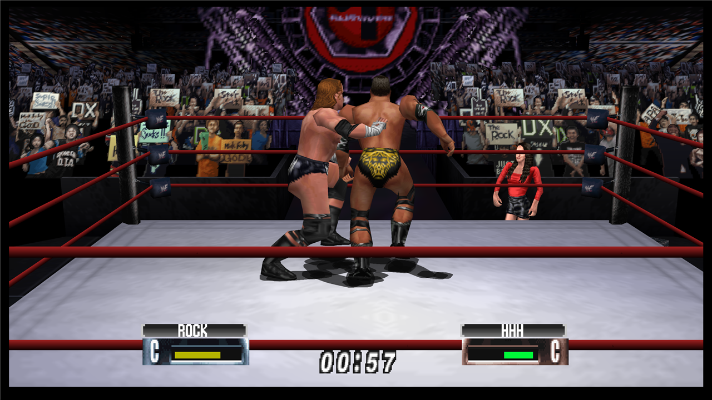
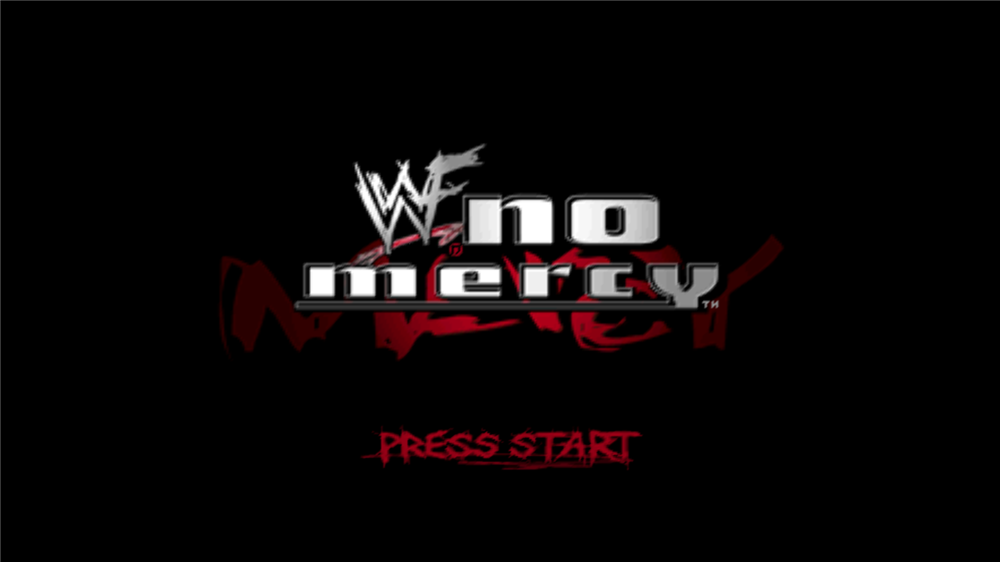
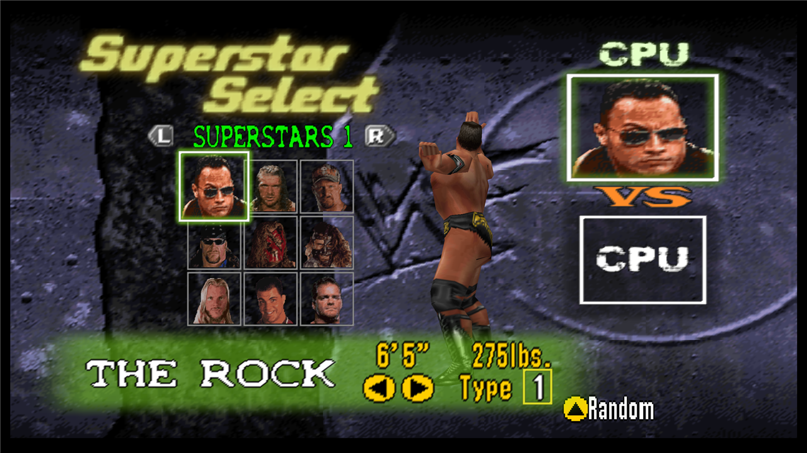

# WWF No Mercy: Recompiled

WWF No Mercy: Recompiled is a project that uses
[N64Recomp](https://github.com/N64Recomp/N64Recomp) to **statically recompile** the
Nintendo 64 game *WWF No Mercy* into a native PC port, running on the
[N64ModernRuntime](https://github.com/N64Recomp/N64ModernRuntime) with
[RT64](https://github.com/rt64/rt64) as the rendering engine. It is the fifth
project in the AKI wrestling recompilation family, after
[WCW vs. nWo World Tour: Recompiled](https://github.com/jessetbh/WCWvsNWOWorldTourRecomp),
[WCW/nWo Revenge: Recompiled](https://github.com/jessetbh/WCWnWoRevengeRecomp),
[WWF WrestleMania 2000: Recompiled](https://github.com/jessetbh/WWFWrestleMania2000Recomp),
and
[Virtual Pro Wrestling 64: Recompiled](https://github.com/jessetbh/VPW64Recomp),
sharing their runtime stack and conventions. No Mercy is WrestleMania 2000's direct
sequel, so that project is this one's closest reference.

### **This repository and its releases do not contain game assets. The original game is required to build or run this project.**

> **Status: beta.** The game boots, renders at high resolution, plays music and
> sound effects, takes keyboard and gamepad input through the menus and matches,
> rumbles, and the cartridge flash save persists automatically across sessions.
> See [Known Issues](#known-issues) for what's still rough.

  
   
  
  

## Table of Contents
* [System Requirements](#system-requirements)
* [Features](#features)
* [FAQ](#faq)
* [Known Issues](#known-issues)
* [Building](#building)
* [Libraries Used and Projects Referenced](#libraries-used-and-projects-referenced)
* [Special Thanks](#special-thanks)

## System Requirements

Currently a **Windows** build is targeted; other operating systems may be supported
later.

A GPU supporting Direct3D 12.0 (Shader Model 6) or Vulkan 1.2 is required. A CPU
supporting the SSE4.1 instruction set is also required (Intel Core 2 Penryn series or
AMD Bulldozer and newer).

## Features

* Plug and play — assets load directly from your ROM, no extraction step
* Hardware-accelerated high-resolution rendering through RT64 with the original
  N64 visual effects intact
* Widescreen support
* In-game config menus with full input rebinding for keyboard and controller
* Default mappings tailored to the AKI control scheme (d-pad movement, analog taunts)
* Flash cartridge save emulation with automatic persistence, plus rumble

## Planned Features

* High framerate support (frame interpolation), pending the family's
  matrix-group work
* Linux support
* Mod support

## FAQ

#### What is static recompilation?

Static recompilation is the process of automatically translating an application from
one platform to another — here, the game's original MIPS machine code is translated
into C and compiled for modern PCs. For details, see
[N64Recomp](https://github.com/N64Recomp/N64Recomp). **This is not an emulator and not
a decompilation.**

#### How is this related to a decompilation project?

It isn't — no public decompilation of WWF No Mercy exists. Unlike most
recompilation ports, which borrow symbol names from a decomp, this project generates
its own symbol metadata from scratch via a [splat](https://github.com/ethteck/splat)
disassembly (see `disasm/` and `syms/`), transferring libultra identifications from
its sister project WWF WrestleMania 2000 by machine-code fingerprinting.

#### Which ROM does it use?

This project is **only** a port of WWF No Mercy, and it only accepts one specific
ROM: the USA **Rev 1** release
(SHA1 `91CEE3D096F4A76644D8B35B9AEAD6448909ABD1`). The original USA release (Rev 0,
which shipped the infamous save-erasure bug) and other regions are **not** accepted.
**It is not an emulator and it cannot run any arbitrary ROM.**

#### Where is the savefile stored?

- Windows: `%LOCALAPPDATA%\NoMercyRecompiled\saves\`

No Mercy saves everything — game progress, unlocks ("SmackDown Mall" purchases), and
created wrestlers — to the cartridge's flash memory; the port persists that flash
image to disk automatically. Configuration files and the log file live one level up
in the same app folder.

#### Can you run this project as a portable application?

Yes — place a file named `portable.txt` in the same folder as the executable and
saves, config files, and the stored ROM will be kept next to the executable instead.

## Known Issues

This is a beta. Known rough edges:

* **Multi-controller sessions** are still being stabilized and can crash; single
  controller (or keyboard) play is solid.
* First launch may pause briefly while shaders compile for your GPU.
* Only the USA Rev 1 ROM is accepted (see the FAQ) — other dumps are rejected at
  intake by design.

Please report anything else through the issue tracker.

## Building

See [BUILDING.md](BUILDING.md).

## Libraries Used and Projects Referenced

* [N64Recomp](https://github.com/N64Recomp/N64Recomp) — the static recompiler this
  port is built with
* [N64ModernRuntime](https://github.com/N64Recomp/N64ModernRuntime) — the modern
  runtime (ultramodern + librecomp)
* [RT64](https://github.com/rt64/rt64) — the rendering engine
* [RecompFrontend](https://github.com/N64Recomp/RecompFrontend) — launcher, config
  menus, and input stack
* [RmlUi](https://github.com/mikke89/RmlUi) for building the menus and launcher
* [lunasvg](https://github.com/sammycage/lunasvg) for SVG rendering, used by RmlUi
* [FreeType](https://freetype.org/) for font rendering, used by RmlUi
* [SDL2](https://www.libsdl.org/) for windowing, input, and audio
* [moodycamel::ConcurrentQueue](https://github.com/cameron314/concurrentqueue) for
  semaphores and fast, lock-free MPMC queues
* [Gamepad Motion Helpers](https://github.com/JibbSmart/GamepadMotionHelpers) for
  sensor fusion and calibration algorithms
* [DirectX Shader Compiler](https://github.com/microsoft/DirectXShaderCompiler),
  [zstd](https://github.com/facebook/zstd),
  [nativefiledialog-extended](https://github.com/btzy/nativefiledialog-extended), and
  [plume](https://github.com/renderbag/plume) via RT64
* [splat](https://github.com/ethteck/splat) / spimdisasm for the disassembly that
  produces this project's symbol metadata
* [Inter](https://rsms.me/inter/), [Noto Emoji](https://fonts.google.com/noto), and
  [PromptFont](https://shinmera.com/promptfont) fonts (OFL; PromptFont license in
  `assets/promptfont/`)
* [SDL_GameControllerDB](https://github.com/gabomdq/SDL_GameControllerDB) for
  community controller mappings
* [WCW vs. nWo World Tour: Recompiled](https://github.com/jessetbh/WCWvsNWOWorldTourRecomp),
  [WCW/nWo Revenge: Recompiled](https://github.com/jessetbh/WCWnWoRevengeRecomp),
  [WWF WrestleMania 2000: Recompiled](https://github.com/jessetbh/WWFWrestleMania2000Recomp),
  [Virtual Pro Wrestling 64: Recompiled](https://github.com/jessetbh/VPW64Recomp),
  [Bomberman Hero: Recompiled](https://github.com/RevoSucks/BMHeroRecomp), and
  [Zelda64Recomp](https://github.com/Zelda64Recomp/Zelda64Recomp) as reference
  projects for structure and conventions

## Special Thanks

* [Wiseguy](https://github.com/Mr-Wiseguy) and
  [DarioSamo](https://github.com/DarioSamo) for creating N64Recomp and RT64.
* [RevoSucks](https://github.com/RevoSucks) and the Bomberman Hero: Recompiled
  project, the template for this port's sister projects and therefore for this one.
* The Zelda64Recomp team for establishing the conventions the whole recomp ecosystem
  follows.
* ethteck and the splat/spimdisasm contributors — the disassembly tooling that made a
  no-decomp recompilation possible.
